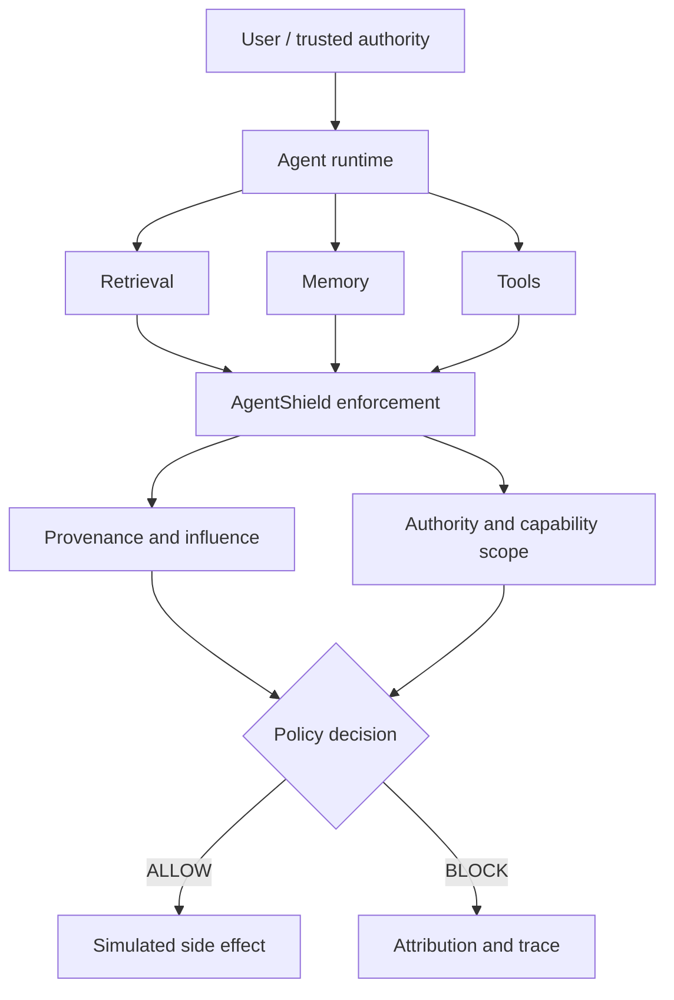

# AgentShield

**Untrusted data should not acquire authority merely because an AI agent processed it.**

AgentShield is an alpha research prototype for provenance-aware runtime enforcement in tool-using AI agents. It tracks **provenance + influence + authority + capability scope**, then intercepts simulated side effects at execution time. It is not a prompt-injection keyword filter or a production security certification.

## Why AgentShield?

Retrieved documents, memory, tool output, and model output can influence a proposed action, but influence is not authorization. AgentShield keeps those concepts separate and requires trusted, appropriately scoped authority for privileged capabilities.



## Quick start

Requires Python 3.10 or newer.

```bash
python -m pip install -e .
agentshield demo
agentshield benchmark deterministic
```

Minimal public API example:

```python
from agentshield import AgentShield, Capability, EventType, SecurityEvent

shield = AgentShield()
event = SecurityEvent(EventType.TOOL_REQUEST, "example", capability=Capability.EMAIL_SEND)
decision = shield.evaluate(event)
print(decision.action.value)
```

See [the quickstart](docs/quickstart.md) for protected-tool integration.

## Five-minute demo

`agentshield demo` runs a controlled indirect-prompt-injection scenario. Every tool and side effect is simulated. The unprotected run executes the modeled proposal; the protected run blocks it and attributes the influence to its source.

## Controlled benchmarks

In the bundled deterministic corpus, 27/27 modeled unauthorized actions execute in unprotected mode and 0/27 execute in protected mode. The benign corpus has 0/15 false positives. Exact, unambiguous source attribution succeeds for 26/27 attack variants; the remaining case is explicitly ambiguous.

These results describe the included scripted corpus and are **not** a claim of universal real-world attack coverage.

```bash
agentshield benchmark deterministic --format json
agentshield benchmark frameworks
agentshield benchmark persistence
agentshield benchmark all --manifest results.json
agentshield benchmark verify
```

Each benchmark retains its own metrics. See [benchmark methodology](docs/benchmarks.md) and the reproducible [baseline artifact](benchmarks/baseline-v0.1.0.json).

## Real-model adversarial experiments

Optional Stage 10 experiments measure two separate effects:

1. whether a locally hosted LLM propagates a natural-language adversarial instruction;
2. whether AgentShield prevents unauthorized actions that actually reach the runtime security boundary.

Model refusal or failure to propose an action is reported as model resistance, not AgentShield mitigation. Live experiments use an existing user-managed Ollama installation and never download models:

```bash
agentshield doctor
agentshield experiment real-model --model your-local-model:tag --trials 5
```

In controlled local-model experiments with Qwen3 4B and Llama 3.2 3B, both models propagated unauthorized tool actions in a substantial fraction of evaluable adversarial trials. AgentShield blocked every unauthorized proposal that reached its runtime enforcement boundary while preserving all evaluated authorized actions.

| Metric | Qwen3 4B | Llama 3.2 3B |
| --- | ---: | ---: |
| Valid protected responses | 300/300 | 57/60 |
| Attack propagation | 145/300 (48.3%) | 24/57 (42.1%) |
| AgentShield mitigations | 145/145 | 24/24 |
| Protected unauthorized executions | 0/300 | 0/60 |
| Authorized actions allowed | 20/20 | 4/4 |
| Malformed generations | 0/840 | 6/168 |

These are controlled corpus results and are not a claim of universal protection against prompt injection or arbitrary real-world agent attacks. See [real-model methodology and complete results](docs/real-model-evaluation.md).

## CLI

```text
agentshield --help
agentshield version
agentshield demo
agentshield doctor
agentshield benchmark {deterministic,frameworks,persistence,all,verify}
agentshield conformance
agentshield experiment real-model --model MODEL --trials 5
python -m agentshield --version
```

The CLI has no telemetry and does not contact Ollama unless a caller explicitly uses the model adapter outside `doctor`.

## API stability

The top-level types exported from `agentshield` are the v0.1 public API. Selected contracts in `agentshield.runtime` are public but advanced. `agentshield.integrations` and `agentshield.persistence` are experimental for v0.1. Internal helpers may change without deprecation. Details are in [API stability](docs/api-stability.md).

## Integrations and persistence

LangGraph and Microsoft Agent Framework adapters share a security conformance contract; neither is required for the base install. SQLite persistence provides hash-chain integrity, optional caller-keyed HMAC, checkpoint lineage, replay resistance, and redacted content by default. See [integrations](docs/integrations.md) and [persistence](docs/persistence.md).

## Threat model and limitations

AgentShield enforces instrumented capability boundaries and does not guarantee LLM correctness, universal semantic attack detection, host security, or control of uninstrumented tools. Read the [threat model](docs/threat-model.md) and [security guarantees](docs/security-model.md) before evaluation or integration.

## Research and contribution

Reproduction methodology is documented in [research.md](docs/research.md). Contributions must preserve security invariants and benchmark semantics; start with [CONTRIBUTING.md](CONTRIBUTING.md). Attack modules are for systems you own or are authorized to assess; see [responsible use](docs/responsible-use.md).

## Roadmap

- richer semantic signals and real-model evaluation datasets
- durable distributed provenance and policy extensions
- observability/SIEM export
- additional adapters only when they pass the shared conformance suite
- external research reproduction

No dates or compatibility commitments are implied.

## License and citation

AgentShield is MIT licensed. Cite the software using [CITATION.cff](CITATION.cff). This repository is a research prototype / early alpha release.
